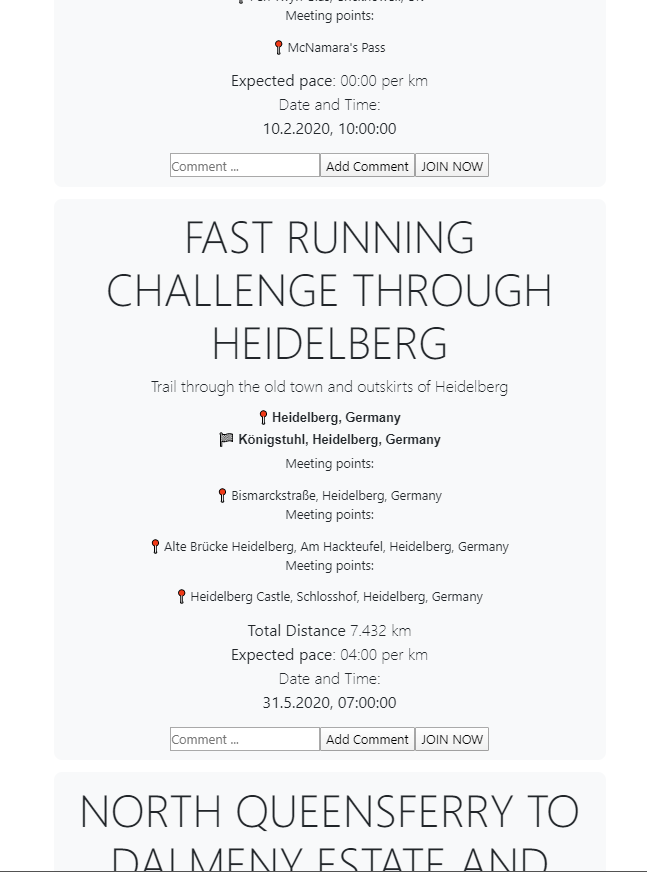

# CS5003 Practical3: Social Runner using Google Maps API
This repository implements a simple application enabling runners to generate, join and view routes. 

* Overview 

* Login Page

* Registration Page

Features included:
* UI: A client-side user interface for user interaction
* RESTful API: A RESTful API written in Node.js/Express for exchanging data between client and the server
* Database: Database backend for persistent storage of data about activities and possible users
* External API: Use of an external API for mapping and distance calculation (e.g. Google Maps)

* Route Planning

* Route Display

The file with a name 'server' contains the code of the server side. 
The file "package.json" tells what packages are needed. 
The "content" folder contains three files. These three files are: 
* index : the HTML file;
* client : the javascript file contains client-side javascript code;
* style : the CSS file;
The database folder holds three files:  
* config-db-example: the configuration file to set up the database (example)
* run-dao: holds Data Access Object and all the functions to insert, retrieve or query information
* user-model: provides the constructors to create the database connection, in this case USER and ROUTE

For run the server, make sure you have installed CouchDB, Node.js, Chrome or Firefox browser and the packages in the "package.json" file. 

<b>CouchDB</b>
https://couchdb.apache.org/
 
<b>Node.js:</b>
https://nodejs.org/en/ 
 
<b>Chrome:</b>
https://www.google.co.uk/chrome/?brand=CHBD&gclid=CjwKCAjwhOD0BRAQEiwAK7JHmLie5EJVCYwVrKvqc_qXTiAONve3IxyvExzj373uvO81Kiud6a9pwRoCSuAQAvD_BwE&gclsrc=aw.ds
 
<b>Firefox:</b>
https://www.mozilla.org/de/firefox/new/

After installing CouchDB, Node.js and Chrome, use "npm install <package name>" to install packages needed. 

* Logout Page

